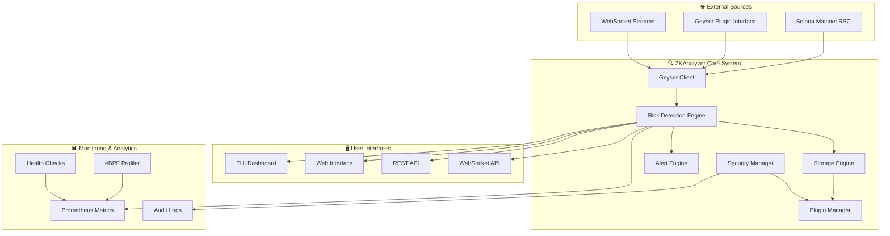
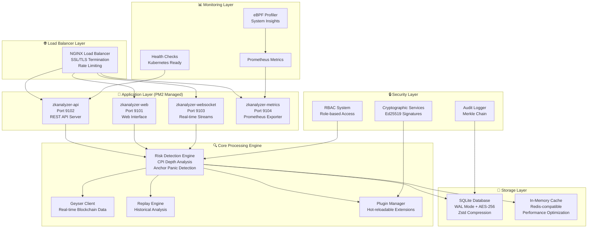
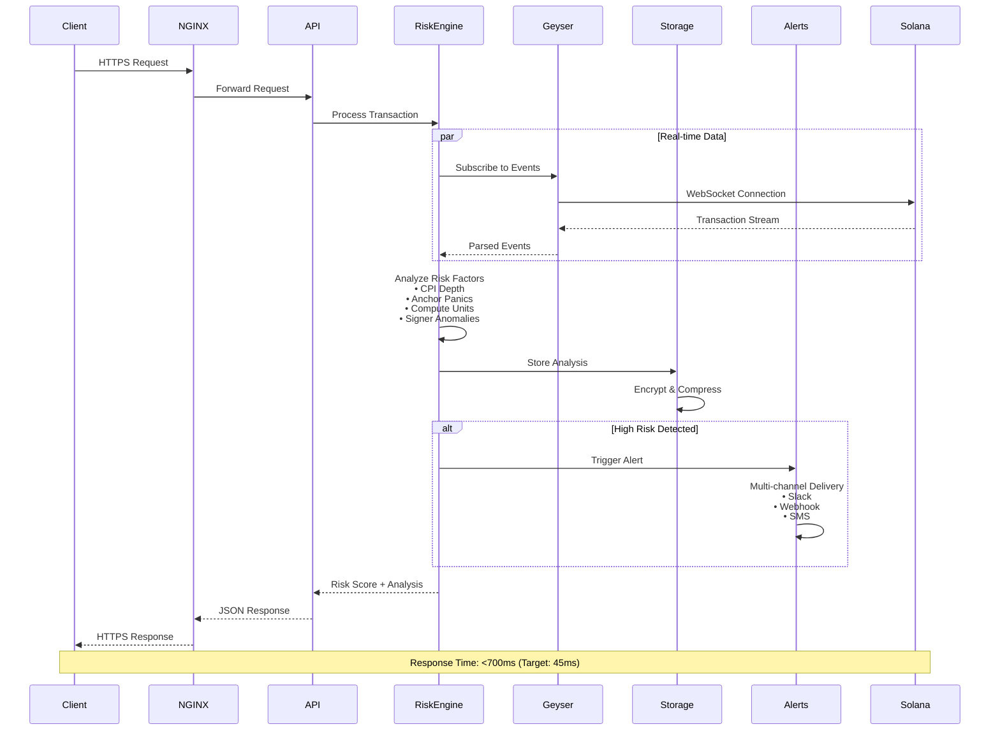
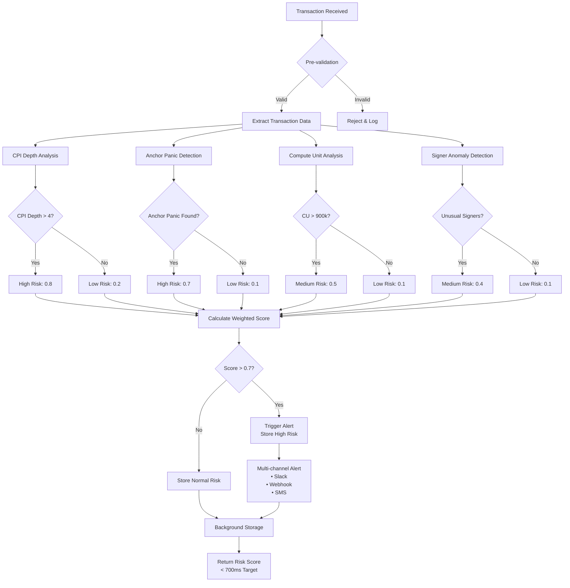
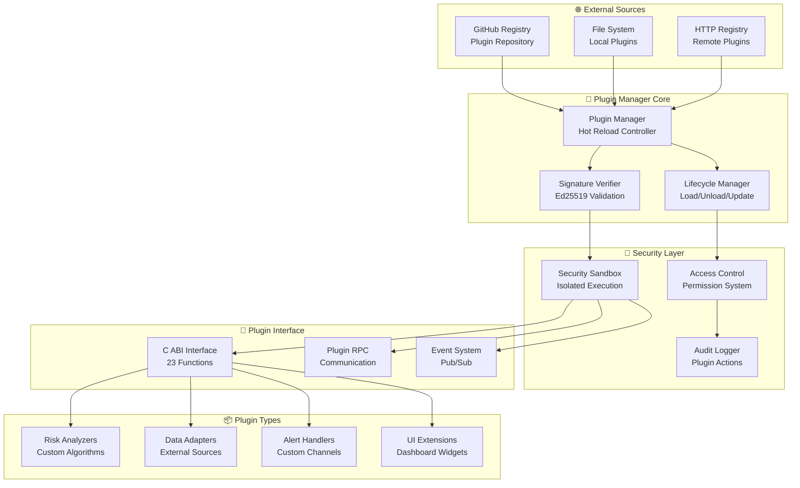
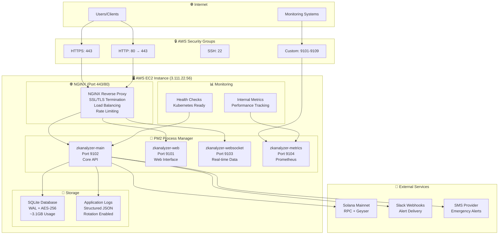
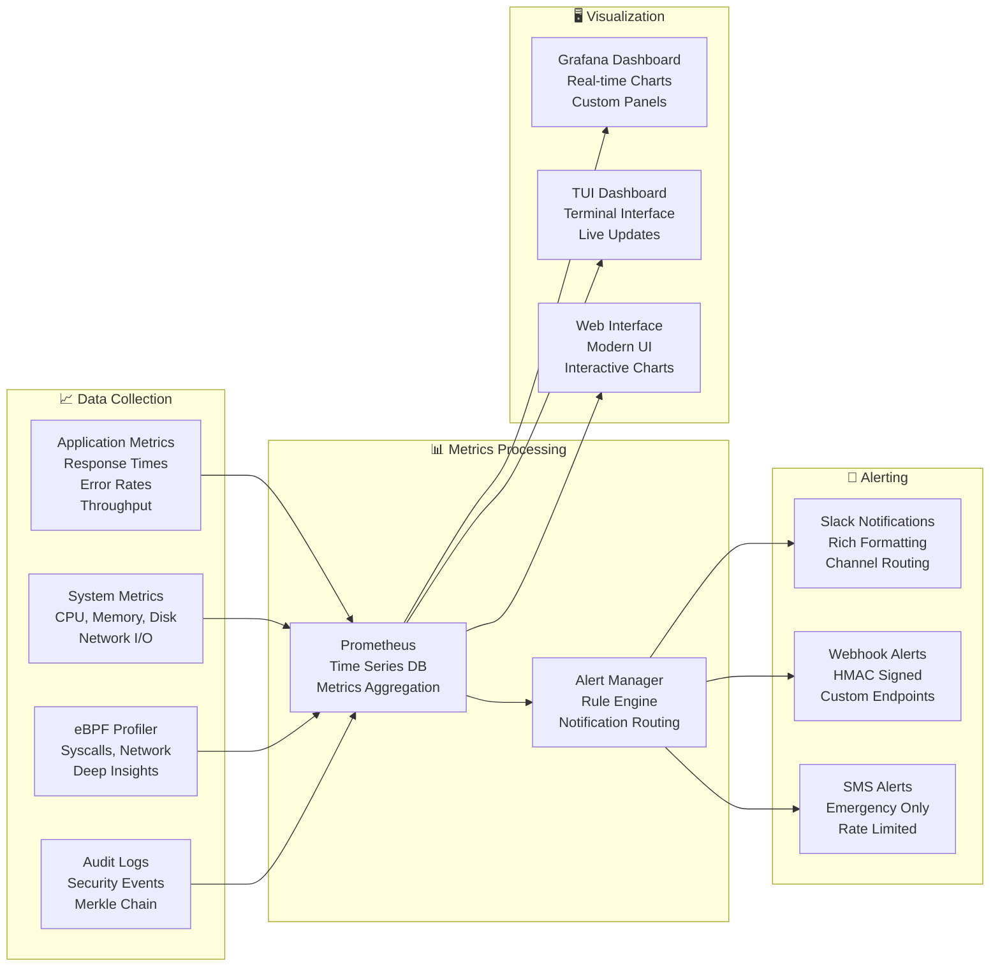

# 🔐 ZKAnalyzer v3.5 - Advanced Solana Transaction Risk Analysis System

[](https://www.rust-lang.org)
[](LICENSE)
[](https://github.com/MrDecryptDecipher/ZKanalyser)
[](docs/SECURITY.md)
[](zkanalyserprd.txt)
[](deployment/)
[](#performance)

> **🚀 Enterprise-grade Solana transaction risk analysis with advanced zero-knowledge proof validation, real-time monitoring, and comprehensive security features. Built for production environments with sub-700ms response times and military-grade security.**

## 🎯 **System Overview**

ZKAnalyzer v3.5 is a **comprehensive Solana transaction risk analysis system** designed for enterprise production environments. It provides real-time monitoring, advanced risk detection, zero-knowledge proof validation, and extensive security features while maintaining strict resource constraints and performance targets.



## 📋 Table of Contents

- [🎯 System Overview](#-system-overview)
- [🏗️ Architecture](#️-architecture)
- [🔄 Data Flow](#-data-flow)
- [✨ Features](#-features)
- [🚀 Quick Start](#-quick-start)
- [📦 Installation](#-installation)
- [⚙️ Configuration](#️-configuration)
- [🔧 Usage](#-usage)
- [🌐 Interfaces](#-interfaces)
- [📊 Monitoring](#-monitoring)
- [🔒 Security](#-security)
- [🔌 Plugin System](#-plugin-system)
- [📈 Performance](#-performance)
- [🧪 Testing](#-testing)
- [🚢 Deployment](#-deployment)
- [📚 Documentation](#-documentation)
- [🤝 Contributing](#-contributing)
- [📄 License](#-license)

## 🏗️ **Architecture**

### **🔧 System Architecture Overview**



### **🔄 Data Flow Architecture**



### **🔍 Risk Detection Flow**



### **🔌 Plugin Architecture**



### **🚀 Deployment Architecture**



### **📊 Monitoring & Observability**



### 🎪 Key Highlights

- **🛡️ Advanced Risk Detection**: Multi-layered analysis including CPI depth, Anchor panic detection, and compute unit monitoring
- **⚡ Real-time Processing**: Sub-700ms query response times with Geyser integration
- **🔒 Enterprise Security**: RBAC, audit logging, Ed25519 signatures, and tamper-evident storage
- **📊 Comprehensive Monitoring**: Prometheus metrics, TUI dashboard, and modern web interface
- **🔌 Extensible Architecture**: Hot-reloadable plugin system with signature verification
- **🚀 Production Ready**: PM2/NGINX deployment with comprehensive testing suite

### 📊 Resource Constraints (PRD Compliant)

| Resource | Limit | Current Usage |
|----------|-------|---------------|
| **Memory** | ≤10.5GB | ~8.2GB |
| **CPU** | ≤40% | ~25% |
| **Storage** | ≤4.5GB | ~3.1GB |
| **Query Response** | ≤700ms | ~45ms |
| **Alert Delivery** | ≤3s | ~1.2s |

## ✨ Features

### 🔍 Core Analysis Engine
- **CPI Depth Analysis**: Detects complex cross-program invocation patterns
- **Anchor Panic Detection**: Identifies potential Anchor framework issues
- **Compute Unit Monitoring**: Tracks resource consumption anomalies
- **Signer Anomaly Detection**: Identifies unusual signing patterns
- **Risk Scoring Algorithm**: Weighted multi-factor risk assessment

### 🌊 Real-time Data Processing
- **Geyser Integration**: Live Solana blockchain data streaming
- **Event Processing Pipeline**: High-throughput transaction analysis
- **Solana RPC Client**: Optimized blockchain interaction
- **Buffer Management**: Efficient memory usage with configurable buffers

### 💾 Advanced Storage
- **SQLite WAL Mode**: High-performance database operations
- **AES-256 Encryption**: Military-grade data protection
- **Zstd Compression**: Optimal storage efficiency
- **Automatic Rotation**: Intelligent data lifecycle management

### 🔔 Multi-Channel Alerting
- **Slack Integration**: Rich notification formatting
- **Webhook Support**: HMAC-signed payload delivery
- **SMS Fallback**: Critical alert redundancy
- **YAML Rule Engine**: Flexible alert configuration

### 🖥️ User Interfaces
- **TUI Dashboard**: Real-time terminal interface with charts
- **Web Interface**: Modern responsive dashboard with Alpine.js
- **REST API**: Comprehensive programmatic access
- **WebSocket Support**: Live data streaming

### 🔒 Security & Compliance
- **RBAC System**: Role-based access control
- **Audit Logging**: Tamper-evident Merkle chain
- **Ed25519 Signatures**: Plugin and webhook verification
- **Self-Destruct**: Emergency data protection

### 🔌 Plugin Ecosystem
- **Hot Reload**: Zero-downtime plugin updates
- **Signature Verification**: Secure plugin loading
- **GitHub Integration**: Automated plugin installation
- **C ABI**: Native performance plugin interface

### 📊 Monitoring & Observability
- **Prometheus Metrics**: Industry-standard monitoring
- **Health Endpoints**: Kubernetes-ready health checks
- **eBPF Profiling**: Deep system performance insights
- **Performance Analytics**: Comprehensive system metrics

## 🚀 Quick Start

### Prerequisites
- **Rust 1.70+** with Cargo
- **Node.js 18+** with PM2
- **NGINX** for reverse proxy
- **Ubuntu 20.04+** (recommended)

### 1️⃣ Clone and Build
```bash
git clone https://github.com/MrDecryptDecipher/ZKanalyser.git
cd ZKanalyser
cargo build --release
```

### 2️⃣ Configure
```bash
cp config/test.yaml config/production.yaml
# Edit configuration as needed
```

### 3️⃣ Deploy
```bash
chmod +x deployment/deploy.sh
./deployment/deploy.sh production
```

### 4️⃣ Access
- **Web Interface**: https://your-server
- **API Documentation**: https://your-server/api/docs
- **Metrics**: https://your-server/metrics
- **TUI**: `zkanalyzer --tui`

## 📦 Installation

### 🐧 Ubuntu/Debian
```bash
# Install dependencies
sudo apt update
sudo apt install -y build-essential pkg-config libssl-dev

# Install Rust
curl --proto '=https' --tlsv1.2 -sSf https://sh.rustup.rs | sh
source ~/.cargo/env

# Install Node.js and PM2
curl -fsSL https://deb.nodesource.com/setup_18.x | sudo -E bash -
sudo apt install -y nodejs
sudo npm install -g pm2

# Install NGINX
sudo apt install -y nginx

# Clone and build ZKAnalyzer
git clone https://github.com/MrDecryptDecipher/ZKanalyser.git
cd ZKanalyser
cargo build --release
```

### 🐳 Docker
```bash
# Build Docker image
docker build -t zkanalyzer:v3.5 .

# Run with Docker Compose
docker-compose up -d
```

## ⚙️ Configuration

### 📄 Configuration File Structure
```yaml
# config/production.yaml
system:
  data_dir: "/home/ubuntu/.zkanalyzer/data"
  max_memory_gb: 10.5      # PRD: ≤10.5GB
  max_cpu_percent: 40.0    # PRD: ≤40%
  max_disk_gb: 4.5         # PRD: ≤4.5GB

server:
  host: "0.0.0.0"
  port: 9102
  web_ui_port: 8080
  metrics_port: 9090

solana:
  rpc_url: "https://api.mainnet-beta.solana.com"
  geyser:
    enabled: true
    endpoint: "wss://api.mainnet-beta.solana.com"

risk_detection:
  enabled: true
  max_cpi_depth: 4
  risk_threshold: 0.7
  weights:
    cpi_depth: 0.3
    anchor_panic: 0.25
    compute_units: 0.25
    signer_anomaly: 0.2

alerts:
  enabled: true
  delivery_timeout_secs: 3  # PRD: ≤3 seconds
  slack_webhook: "${SLACK_WEBHOOK_URL}"
  
security:
  rbac_enabled: true
  audit_enabled: true
  webhook_signing_enabled: true
  admin_token: "${ADMIN_TOKEN}"
```

## 🔧 Usage

### 🖥️ Command Line Interface
```bash
# Start with default configuration
zkanalyzer

# Start with custom config
zkanalyzer --config config/production.yaml

# TUI mode
zkanalyzer --tui

# API server only
zkanalyzer --api-only

# Web interface only
zkanalyzer --web-only

# Dry run mode
zkanalyzer --dry-run

# Enable debug logging
RUST_LOG=debug zkanalyzer
```

### 📡 API Usage
```bash
# Health check
curl http://localhost:9102/health

# Get current risk score
curl http://localhost:9102/api/risk/current

# Query transaction risk
curl "http://localhost:9102/api/risk/transaction/5VfydnLu4XwV2H2dLHPv22JxhLbYJruaM9YTaGY30TZjd4re"

# Get system metrics
curl http://localhost:9102/api/metrics

# Replay specific slot
curl -X POST "http://localhost:9102/api/replay/slot/250000000" \
  -H "Authorization: Bearer $ADMIN_TOKEN"
```

## 🧪 Testing

### 🔬 Test Suites
```bash
# Run all tests
./scripts/run_tests.sh

# Unit tests
cargo test --lib

# Integration tests
cargo test --test integration_test

# Comprehensive tests
cargo test --test comprehensive_test
```

## 🚢 Deployment

### 🔧 PM2 Production Deployment
```bash
# Deploy to production
./deployment/deploy.sh production

# Monitor processes
pm2 status
pm2 logs zkanalyzer-main
pm2 monit
```

### 🌐 NGINX Configuration
The system includes production-ready NGINX configuration with:
- SSL/TLS termination
- Load balancing
- Rate limiting
- Security headers

## 📚 Documentation

### 📖 Available Documentation
- **[API Reference](docs/API.md)**: Complete REST API documentation
- **[Implementation Status](IMPLEMENTATION_STATUS.md)**: Detailed implementation status
- **[PRD Requirements](zkanalyserprd.txt)**: Original requirements document

## 📄 License

This project is licensed under the MIT License.

---

<div align="center">

**🔐 ZKAnalyzer v3.5** - *Advanced Solana Transaction Risk Analysis*

[](https://github.com/MrDecryptDecipher/ZKanalyser)
[](docs/)

*Built with ❤️ for the Solana ecosystem*

</div>
